<style>
section::after {
  content: attr(data-marpit-pagination) "/" attr(data-marpit-pagination-total);
}
</style>


Fundamentals of Digital Electronic Systems Design using HDL(1),23/24-P

### Study Project

_Demid Kaidalov_
_3rd course, bachelor's_
_211REC096_


---
<style scoped>section { justify-content: start; }</style>

# Mandelbrot Set


---
<style scoped>section { justify-content: start; }</style>

# Problem


$f_c(z) = z^2 + c$

$z_0 = 0$

<br/>
<br/>

$2^{64} = 1.845e19$

---


Center Point: 
$-1.74...75 - j0.00...55$

<br/>

Zoom: $1.7x10^{301}$

<br/>

Float Size: **_640_** Bytes !!!

<br/>

Calculation Time: **_Months_** !!!

---

<style scoped>section { justify-content: start; }</style>

# Solution
#### **Custom Hardware:**
- _ASIC_ - Custom Chip
- _TinyTapeout_ - Small ASIC
- _**FPGA**_ - HDL Design


--- 

<style scoped>section { justify-content: start; }</style>

# FPGA Design

- Multiply Block
- Mandelbrot Core
- Mandelbrot Cluster Avalon-MM
- HTTP Proxy


---
<style scoped>section { justify-content: start;  }</style>

# Multiply Block

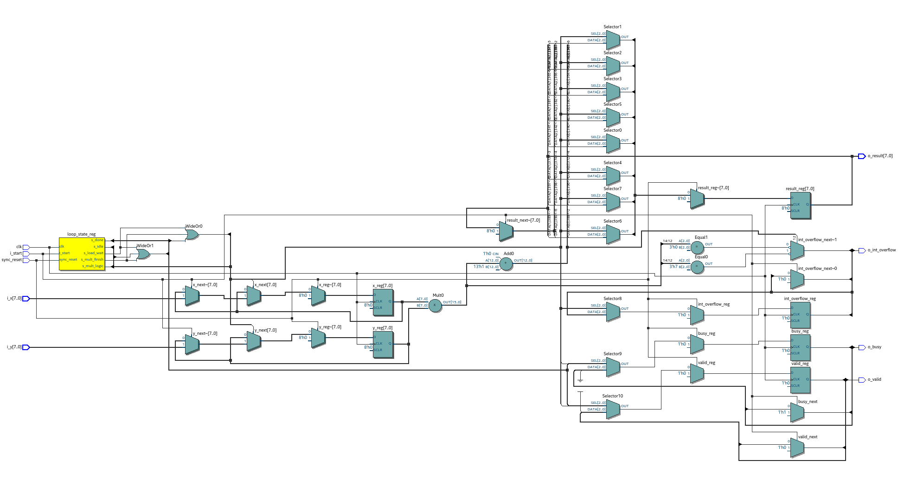

---
<style scoped>section { justify-content: start; }</style>

# Mandelbrot Core

```python
def mandelbrot_core(x0, y0, max_iter):
    x = 0
    y = 0

    for itt in range(max_iter):
        if x ** 2 + y ** 2 > 2 ** 2:
            return itt
            
        xtemp =  x ** 2 - y ** 2 + x0
        y = 2 * x * y + y0
        x = xtemp

    return max_iter
```

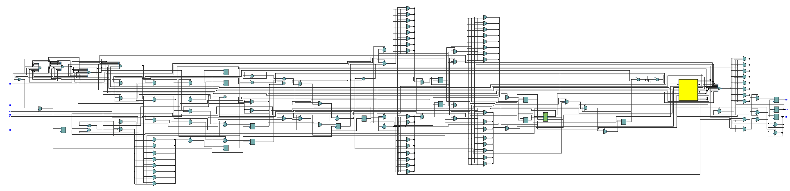

---
<style scoped>section { justify-content: start; background-position: 100px 0; background-size: cover; }</style>

# Simulation

VHDL Test Bench
```vhdl
while test_suite loop
    if run("test_point_calculation") then
        -- Reset core
        core_reset <= '1';
        wait for 50 ns;
        core_reset <= '0';
        wait for 50 ns;

        ...

        check(not timeout_occurred, "Timeout occurred during calculation");

        log("%MAND_CORE_RESULT_START%" & to_string(core_result) & "%MAND_CORE_RESULT_END%" & LF);

    end if;
end loop;
```

Python Runner
```python
test_configs, python_mand_image = generate_test_benches(
    width=20, fixed_integer_size=4, fixed_size=124, max_iterations=24
)
for config in test_configs:
    prj.library("mand").test_bench("tb").test("test_point_calculation").add_config(
        **config
    )


# run VUnit simulation
prj.main(test_result_parser(python_mand_image))
```


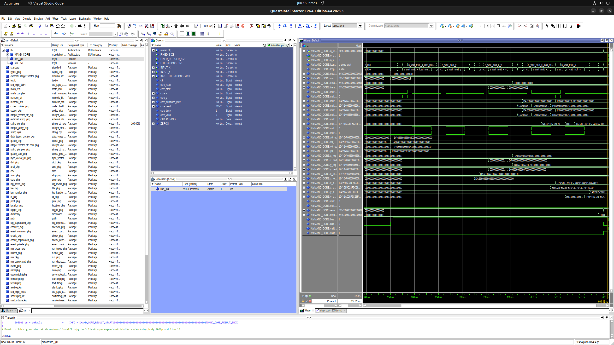

---
<style scoped>section { justify-content: start; background-position: 100px 0; background-size: cover; }</style>

# Simulation Results

1) Wihout overflow check or rounding logic
2) Without overflow check
3) Final version

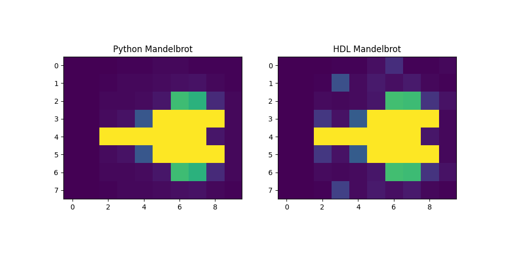
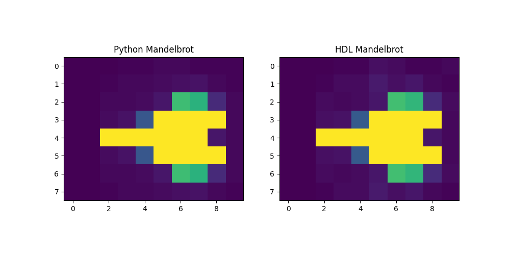
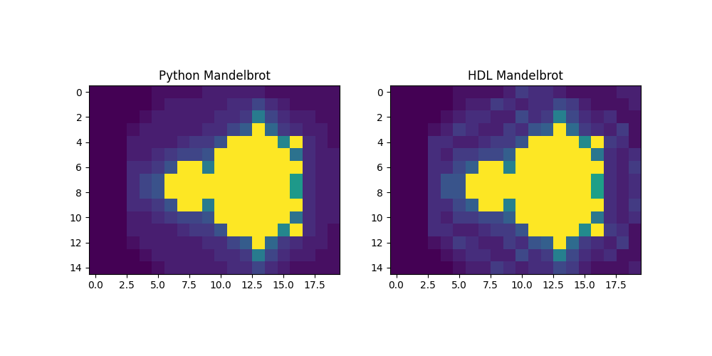

--- 
<style scoped>section { justify-content: start; background-position: 100px 0; background-size: cover; }</style>

# Cluster Avalon-MM

Final Configuration:
- **6** Cores
- **128** Bit Fixed Point
- Compilation time: ~**15** minutes

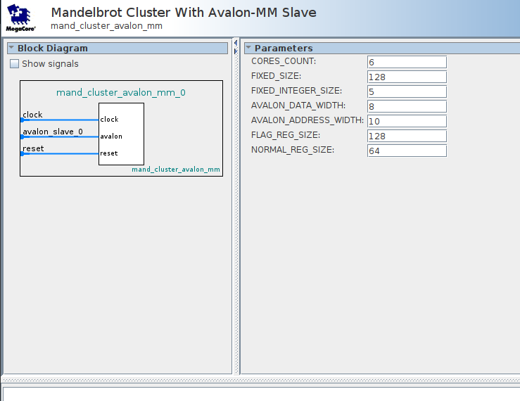
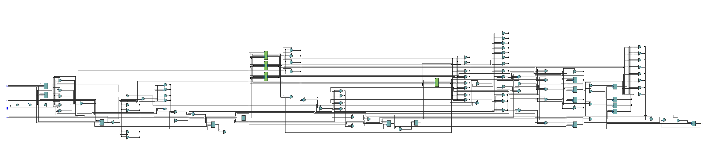
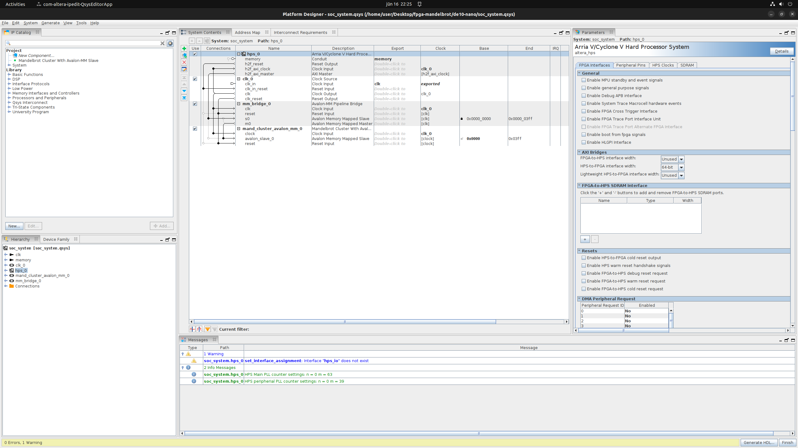

---
<style scoped>section { justify-content: start; }</style>

# HPC Runtime

<br/>

Full Custom (latest):
1) Boot loader: **U-Boot**
2) Linux Kernel: **6.1.68**
3) RootFS: **Debian 12**


---

<style scoped>section { justify-content: start; } </style>

# C Test


```C
struct __attribute__((__packed__)) mand_cluster
{
    uint64_t cores_count;
    uint64_t fixed_size;
    uint64_t fixed_integer_size;

    uint64_t command;
    uint64_t command_status;
    uint64_t core_address;
    uint8_t cores_busy_flag[128 / 8];
    uint8_t cores_valid_flag[128 / 8];

    uint64_t core_result;
    uint64_t core_busy;
    uint64_t core_valid;

    uint64_t core_max_itterations;
    uint8_t core_x[128 / 8];
    uint8_t core_y[128 / 8];
};
```

---
<style scoped>section { justify-content: start; } </style>

# /dev/mem


```C
int main(int argc, char **argv)
{

    uint8_t *bridge_map = NULL;

    int fd = 0;
    int result = 0;

    fd = open("/dev/mem", O_RDWR | O_SYNC);

    if (fd < 0)
    {
        perror("Couldn't open /dev/mem\n");
        return -2;
    }

    bridge_map = (uint8_t *)mmap(NULL, sizeof(struct mand_cluster), PROT_READ | PROT_WRITE,
                                 MAP_SHARED, fd, BRIDGE);

    if (bridge_map == MAP_FAILED)
    {
        perror("mmap failed.");
        close(fd);
        return -3;
    }

    struct mand_cluster *cluster = (struct mand_cluster *)(bridge_map + 0);

    result = munmap(bridge_map, BRIDGE_SPAN);

    if (result < 0)
    {
        perror("Couldnt unmap bridge.");
        close(fd);
        return -4;
    }

    close(fd);
    return 0;
}
```

--- 

<style scoped>section { justify-content: start; } </style>

# Rust HTTP Proxy

Simple Web Server
```rust
#[post("/calculate")]
async fn calculate(
    Json(request): Json<CalculateRequest>,
    cluster: Arc<ClusterScheduler>,
) -> impl IntoResponse {
    let result = cluster.run_callculation(x, y, max_itterations).await;

    match result {
        Ok(result) => (StatusCode::OK, Json(CalculateResponse {result}))
        Err(err) => (StatusCode::INTERNAL_SERVER_ERROR, err.to_string())
    }
}

```


---
<style scoped>section { justify-content: start; } </style>

# Final Result

<br />

Python request

```python
resp = requests.post(
    "http://fpga:8000/calculate",
    json={
        "x": x_f,   # Hexadecimal
        "y": y_f,   # Hexadecimal
        "max_itterations": MAX_ITTERATIONS,
    },
)
```

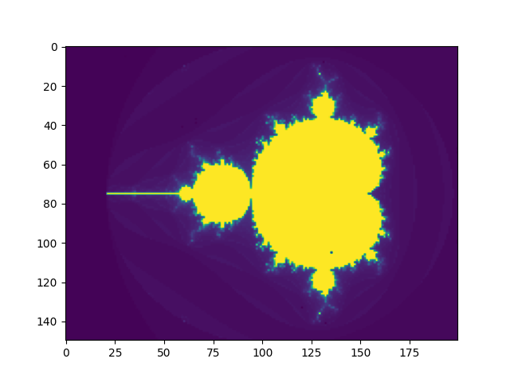

--- 
<style scoped>section { justify-content: start; } </style>

# Benchmark Setup (PC)

- AMD Ryzen 7 7700 8-Core Processor, 4.3 GHz
- 32GB DDR5

```rust
fn calculate_mandelbrot<T: Fixed>(x0: T, y0: T, max_itterations: u64) -> u64 {
    let mut x = T::from_num(0);
    let mut y = T::from_num(0);
    for itteration in 0..max_itterations {
        if x_s * x_s + y_s * y_s > bound_radius { return itteration; }
        let x_temp = x_s * x_s - y_s * y_s + x0;
        y = fixed_2 * x * y + y0;
        x = x_temp;
    }
    max_itterations
}
```

---
<style scoped>section { justify-content: start; } </style>

# Benchmark Results

<br />

- **FPGA** - **0.5** M ittr/s
- **PC** - **600** -> **120** M ittr/s

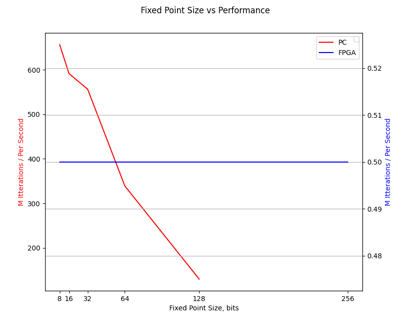

---
<style scoped>section { justify-content: start; } </style>

# Problems

<br />

1) Very limited FPGA resources
2) Free IP Cores
3) Lite version of Quartus:
    - Limited VHDL 2008 support
    - Extremely slow compilation
    - No advanced features
4) No enough time for optimization

---
<style scoped>section { justify-content: start; } </style>

# Design Problems

1) **Multiply Block**: 
    - Rounding logic
    - Time optimization
2) **Cluster**: 
    - Avalon-MM bus
    - Cores synchronization
3) **HPS**:
    - FPGA communication lacks synchronization

---

# Thank you for your attention!

<br />

Useful Links:
- [Absolute beginner's guide](https://github.com/zangman/de10-nano)
- [Mandelbrot Set](https://en.wikipedia.org/wiki/Mandelbrot_set)
- [Project REPO](https://github.com/dk731/fpga-mandelbrot-accelerator)