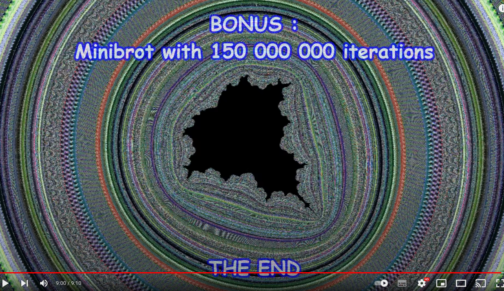
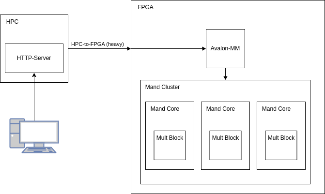

Fundamentals of Digital Electronic Systems Design using HDL(1),23/24-P

### Study Project

_Demid Kaidalov_
_3rd course, bachelor's_
_211REC096_

---

# Mandelbrot Set

---

# Problem

$f_c(z) = z^2 + c$

$z_0 = 0$

 
 

$2^{64} = 1.845e19$

---

Center Point: 
$-1.74...75 - j0.00...55$

 

Zoom: $1.7x10^{301}$

 

Float Size: **640** Bytes!!!

---

# Solution
#### **Custom Hardware:**
- _ASIC_ - Custom Chip
- _TinyTapeout_ - Small ASIC
- _**FPGA**_ - HDL Design

--- 

# FPGA Design

- Multiply Block
- Mandelbrot Core
- Mandelbrot Cluster Avalon-MM
- HTTP Proxy

